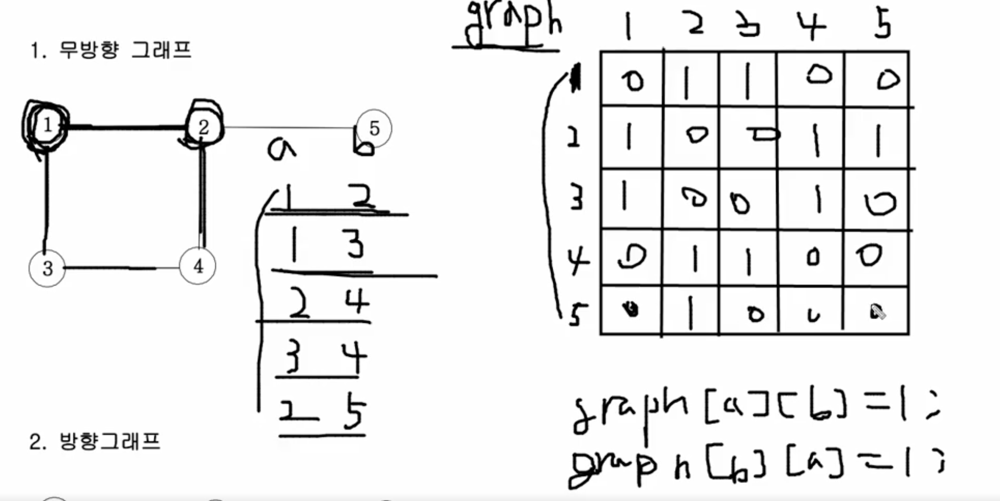
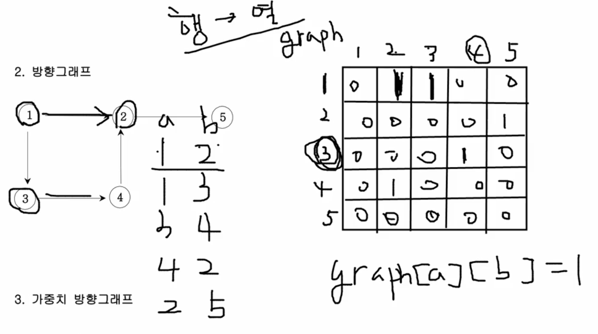
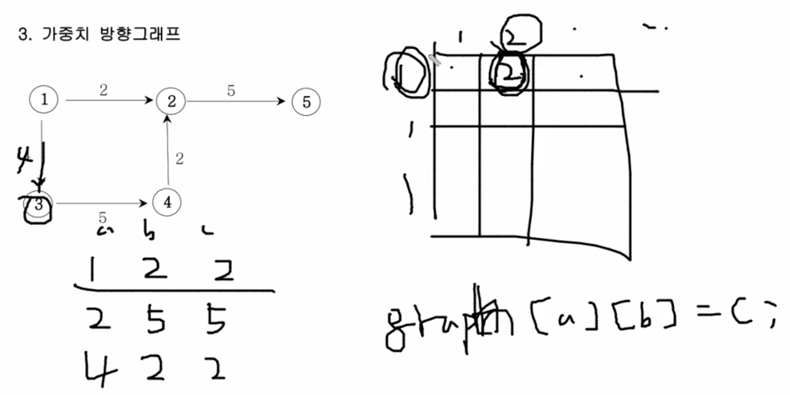

# 그래프와 인접행렬

## 무방향 그래프

1.  인접행렬을 2차원 배열 graph로 선언한다.

2.  서로 연결된 정점 number를 인덱스로 하여 아래와 같이 1로 표시하여 간선 정보를 표시한다.

    ```javascript
    graph[a][b] = 1;
    graph[b][a] = 1;
    ```

    

3.  graph의 행 번호를 탐색한다.

    3-1. 1이라고 체크된 정점만 해당 인덱스와 연결된 정점들이다.

ex) 1행은 2번과 3번 정점과 연결되어 있다.

## 방향 그래프

1. 인접행렬을 2차원 배열 graph로 선언한다.

2. 행번호에서 열번호로 해석하자! (방향을 나타내는 a->b)는 아래와 같이 정보를 표시한다.

   ```javascript
   graph[a][b] = 1;
   ```

   

3. 행 번호를 탐색하여, 해당 행 번호에서 이동하는 열 번호들을 확인한다.

## 가중치 방향 그래프

가중치 방향 그래프란 아래의 그림을 예시로 하여 설명을 들자면, 1번 노드에서 2번 노드로 이동할 때, 2라는 가중치가 드는 것을 나타내는 그래프이다.

1.  인접행렬을 2차원 배열 graph로 선언한다.

2.  방향으로 연결된 행 번호와 열번호 자리에 해당 가중치의 수치를 넣어준다.

    ```javascript
    graph[a][b] = 가중치number;
    ```

    
